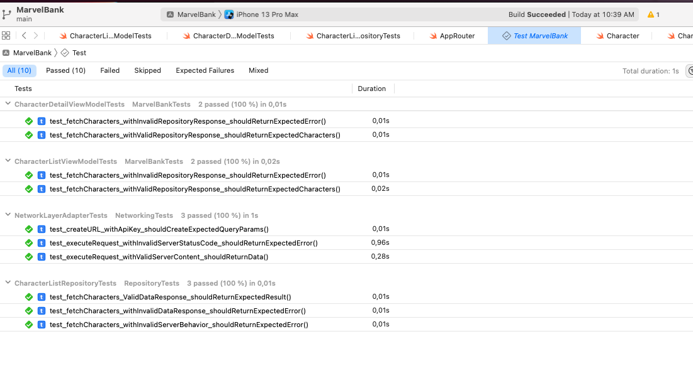

# MarvelBank

Prueba desarrollada en Xcode 13.4.1 y Swift 5.5

- [Diseño de la prueba](#diseño-de-la-prueba)
  - [Capas](#capas)
- [Guías utilizadas](#guías-utilizadas)
- [Pantallazos](#pantallazos)
- [Unit Tests](#unit-tests)
- [Ejecución](#ejecución)
- [FAQ](#faq)

---

## Diseño de la prueba

Dado que se trata de una prueba técnica, he decidido que asumiré que este proyecto está destinado a crecer exponencialmente. Dicho esto, he creado una arquitectura destinada a soportar a varios desarrolladores trabajando al mismo tiempo y que va a crecer de forma agresiva durante su desarrollo.

La aclaración anterior la hago, para dar a entender que a simple vista el proyecto se puede sentir como sobre ingeniería, y si, yo no haría tantas capas para una app que conste de dos pantallas, pero como el objetivo de esta prueba es demostrar habilidades técnicas, aquí estamos asumiendo que sería una app de proporciones industriales.

---

### Capas

Para este proyecto se construyeron 4 capas diferentes y una presentación (al app como tal)

Cada capa está implementada como un Swift Package, del cual entre sus ventajas nos permite escoger si se va a ejecutar como una librería dinámica o estática, y adicional a ello nos da más flexibilidad para interpolar entre ellos mismos, junto a otros beneficios.

---

**1. Repository**

La capa repositorio se encargará de gestionar todas las comunicaciones con red. Entre sus responsabilidades:

- Serialización de data del servidor a entidades locales
- Manejo de errores contra red
- Manejo y gestión de endpoints

_Dependencias:_

- Networking
- Common
- Langugae

Idealmente cada módulo de la app debería tener su propio repositorio.

---

**2. Common**

La capa common se encargará de guardar y gestionar todas las extensiones, helpers, utils, bases, que el proyecto pueda utilizar.

Esta capa debería ser transversal en todo el proyecto y permitirse usar desde cualquier otra dependencia.

_Dependencias:_

- Langugae

---

**3. Language**

La capa Language se encargará de gestionar todos los Strings de la aplicación, así como idealmente debería ser quien mantenga los mismos en diferentes idiomas. Para esta prueba no se hizo traducción pero se establece el objetivo de la misma.

Esta capa debería ser transversal en todo el proyecto y permitirse usar desde cualquier otra dependencia.

_Dependencias:_

- Niguna

---

**4. Networking**

La capa Networking se encargará de las comunicaciones directas con red, así como las instrucciones para enviar el hash, api y private key que requiere la api. A diferencia de otras capas de red, esta no serializa inmediatamente la respuesta que la presentación necesita, pues como estamos desacoplando lo más posible, esta última tarea la delega a quien necesite, para nuestro caso, los repositorios.

_Dependencias:_

- Language
- Common

---

**4. Presentation**

La capa presentación se encargará de gestionar todas las vistas de la aplicación con ayuda de las demás capas, aquí usamos dos patrones importantes:

1. Coordinator: navegación
2. MVVM: gestión de vistas y modelos

Cada módulo de la app debería construirse con los siguientes artefactos:

- Router
- Factory
- ViewController
- ViewModel

Ejemplo:

_Dependencias:_

- Language
- Common
- Repository

---

## Guías utilizadas

- Para guías de estilos, [Google Swift Guidelines](https://google.github.io/swift/)
- `Combine` para comunicación reactiva en las vistas
- `Swift Packages` para gestionar cada capa como un módulo diferente

---

## Pantallazos

Si puedo ser sincero, no escatimé mucho en el diseño o la funcionalidad de la app como tal, preferí dedicar mis esfuerzos en montar una arquitectura escalable y reutilizable para demostrar mis conocimientos en iOS.

---

## Unit Tests

Para el desarrollo de esta prueba se hicieron los Unit Tests necesarios para cubrir cada capa de la app.

El patrón utilizado para los mismos es el [AAA](https://developers.mews.com/aaa-pattern-a-functional-approach/#:~:text=The%20AAA%20pattern%20is%20a,the%20primary%20function%20being%20tested.)

---

## Ejecución

Para ejecturar la app:

1. Clonar el repositorio
2. Abrir el archivo `MarvelBank.xcworkspace`

_Nota: No se utilizó ningún gestor de dependencias externas._

## FAQ

- **¿Por qué no usaste SwiftUI?**
  - Por que no soy un experto, lo sé utilizar, pero no me concidero técnicamente fuerte en el mismo aún, y para una prueba técnica no se puede improvisar.
- **¿Por qué usaste Combine? ¿Por qué no delegate patterns o closures?**
  - Conozco bien los patrones anteriores, pero el mundo del desarrollo avanza poco a poco hacia la reactividad y es un inevitable, y parte de esta prueba demuestra que tan actualizado se mantiene uno como desarrollador, lo mismo aplica para el uso de `await/async`.
- **¿Por qué no usaste librerías de terceros? ¿Por qué reinventar la rueda?**
  - Porque es una prueba técnica, y quiero demostrar que tengo el conocimiento para hacer una app totalmente desde cero sin dependencias. Aún así, prefiero siempre tener el control.
- **¿Por qué están hardcoded las credenciales del API en el proyecto?**
  - Idealmente no debería ser así, y estoy conciente de ello. Pienso que en el mundo ideal un buen proceso de CI debería inclurirlas y así nadie tendría acceso a ellas. Sin embargo para esta prueba técnica quise simplificar esta parte en caso de que clonen el repositorio y decidan ejecutar la app.

---

Mi perfil original de Github es: https://github.com/mejiagarcia. Para mi trabajo actual uso este perfil entonces no quisiera que mis compañeros notaran que he estado haciendo esta prueba ténica (pues la tendré que poner pública). Por esto creé este perfil.

Gracias por leer!
